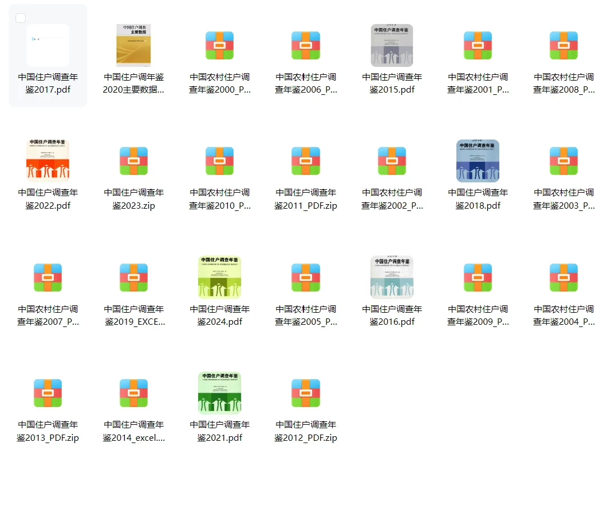
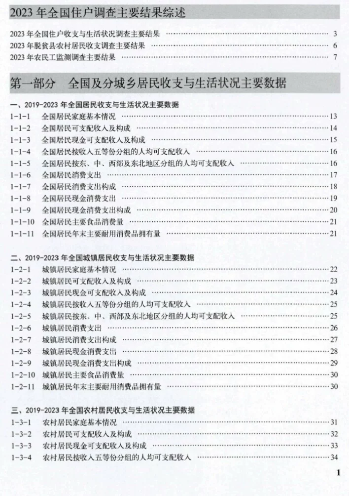
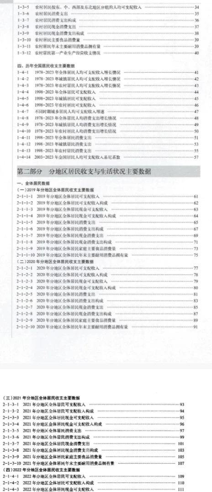
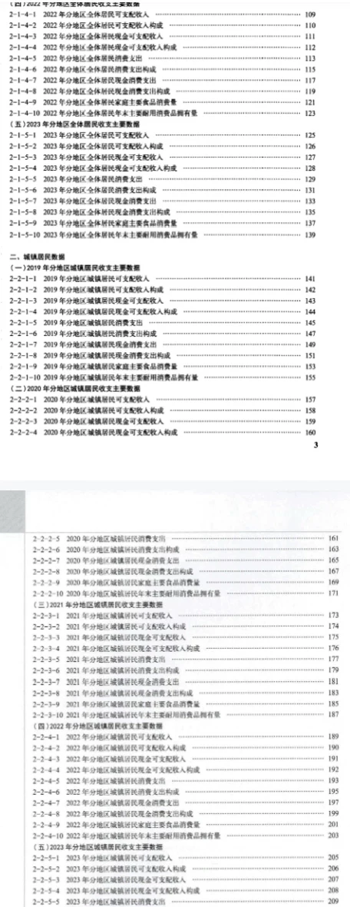
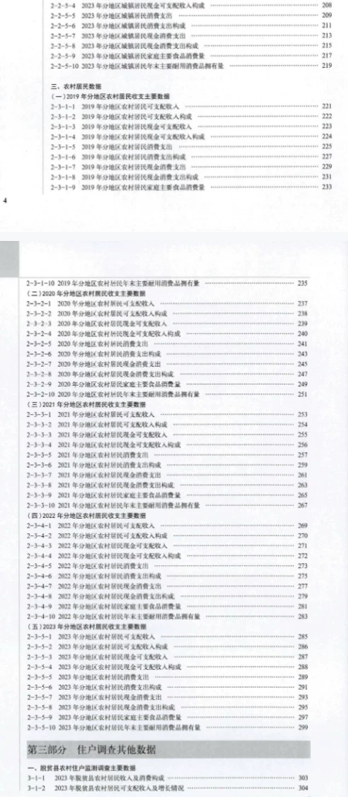
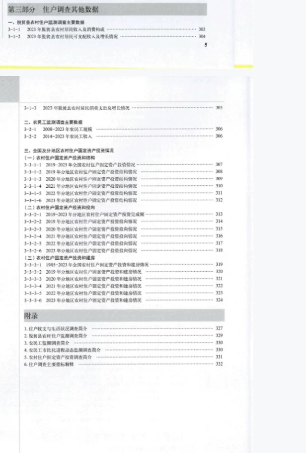

## Body

"China Household Survey Yearbook" (2000-2025)

Data year: The yearbook covers the years 2000 to 2025, with the data year reduced by one. It is an original yearbook and not a compiled panel data set. Please read carefully before purchasing.

01. Data Introduction
The "China Household Survey Yearbook" is compiled based on data from national household income and expenditure surveys, aiming to systematically reflect the current economic and living conditions of urban and rural residents in China.

02. Indicator Details
The directory is displayed in the image, please view it on your own. If you need help finding specific indicators, feel free to ask. There are many indicators here, and I cannot assist in finding them for you. Support refunds without reason are not accepted.
The display directory includes 2024, with a vast amount of content. For those who wish to use search engines to understand the content before purchase, different statistical year standards may change over time. Academic knowledge is expected to be understood.

03. Data Content
For the years 2000, 2006, 2001, 2008, 2023, 2010, 2011, 2002, 2003, 2007, 2019, 2005, 2009, 2004, 2013, 2014, 2021, the data is in ZIP files. Unzip them to find either Excel or PDF formats. Some PDFs and Excels are available. For the year 2025, both Excel and PDF formats are available. For other years, the data is in PDF format. Please make sure to check before purchasing. Those who are sensitive to this should not purchase.

## Images

item_1070600566514

Here is a pay link on Stripe ( https://buy.stripe.com/3cs8yP7sY87d0vu9AB ). Please contact me lonlonago@foxmail.com after funding $89, and I will send you a complete data files , thank you!

